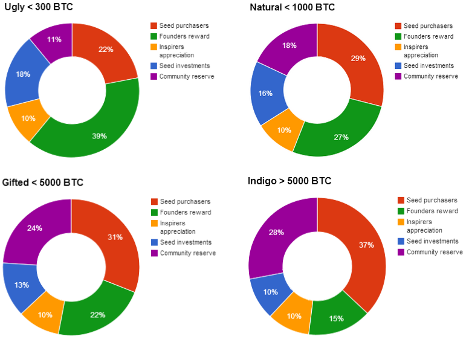
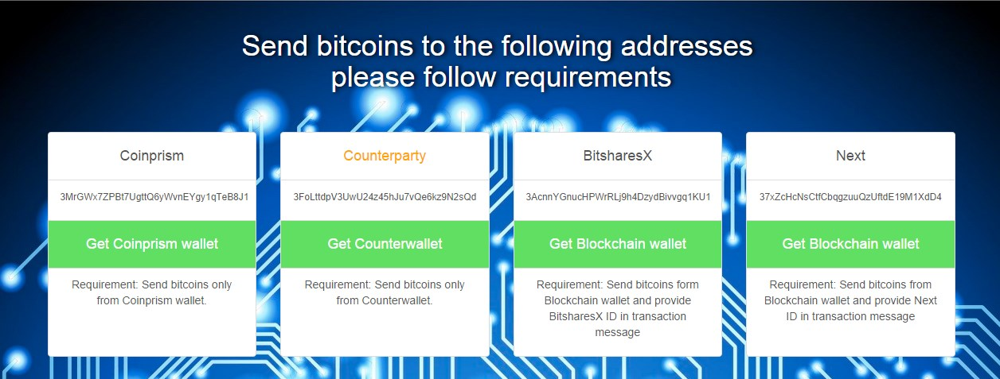

# Terms of Genesis Sale Race

## 1 General
Genesis Address invented [1BQmQ9Qh73yZ37R7pHrxvXoREPa4Am1Qqw](https://www.coinprism.info/address/1BQmQ9Qh73yZ37R7pHrxvXoREPa4Am1Qqw).

Decided that there is only 1 000 000 of True [cyber•Shares](https://www.coinprism.info/asset/3BUQAssohZgE13keAeRTgy5jnGSHR1v119) ever existed.

The Genesis Sale Race will begin from a moment of proving the existence of this paper.

The Genesis Sale Race will run for 61 days and will end at 23:59:59 GMT on November 20, 2014.

Particular quantity of cyber•Shares to distribute will be calculated and published after 3 days after finishing GSR.

For ensuring successful funding and smooth community involvement within Genesis Sale Race provided 5 motivation programs: funding boost program, risk acceptance program, community involvement program, personal motivation program and development program.

## 2 Funding boost program
The distribution model motivates community to reach funding goals.  More funded => less goes to founders, more to purchaser, more for future developments => more stable ecosystem becomes.

After Genesis Sale Race will finished depending of the amount BTC that will be founded, will be calculated quantity of cyber•Shares that will be distributed to:

### Seed purchasers
The pool will be split in proportion between Purchasers in accordance with funding boost, risk acceptance and personal motivation programs. 

### Founders reward
The pool of cyber•Shares which will be splitted between founders.

### Inspirers appreciation
The pool of cyber•Shares for airdrop to the leaders of cyber community. List of suggested leaders could be found [here](https://docs.google.com/a/cyberfund.io/spreadsheets/d/1rks92sn8Ft_GU41q7P6VSrUHUJ5NKllYnCn4jsAuYL8/edit#gid=96940740). This pool distributed proportionally. Rejected airdrops goes to Community Reserve. This pool is fixed because contribution of these peoples is obvious and independent on funded volume.

### Seed investments
The pool of cyber•Shares for the development of core products. This pool is early stage agreement of shareholders.

### Community Reserve
The pool of cyber•Shares for future development. This pool can be used by decision of shareholders for strategic partnerships, investing in products, future reward programs etc. Structure of this pool could be evolved by decision of shareholders.

## 3 Risk acceptance program

For investor who accept risks of unsuccessful Genesis Sale Race smart discounts provided. In case of every 12 events will occur price for last Purchaser will be ~42% higher than for the first Purchaser. So program will be target by the following events:

That is, when the event occurred the price for cyber•Shares will raise. For every event should be provided [proof-of-existence](http://www.proofofexistence.com/).
For example when the chinese translation of paper will be published, the price for the next Purchasers will be high in 5% from base price. When Awesome site will be published the price for the next Purchasers will be high in 10% and so on.
Community will be motivated to have these events occurred more quickly. So that program will make the capitalization of cyber•Fund tend to be higher but ensuring fair price of cyber•Shares.

## 4 Community involvement program
Distribution program provides special Sale race award bounty. During Genesis Sale Race everybody from the community of cyber•Fund can receive a part of this bounty for contributing to success of Genesis Sale Race according to the tables below:

## 5 Personal motivation program
During Genesis Sale Race for every purchaser who accepts risks of higher volume investments personal motivation program is provided. Than more Purchaser will buy cyber•Shares than better price Purchaser has. Discount will be calculated from the base price.

For every Purchaser will be provided unique digital badges issued by cyber•Fund.

In the interest of fairness and inclusiveness, cyber•Fund will apply certain limitations on the sale of cyber•Shares.

In order to give as many interested parties as possible the opportunity to purchase cyber•Shares in the Genesis Sale, cyber•Fund will restrict any single entity, person, corporation, or group from controlling more than 12.5% of the total cyber•Shares sold by the end of the Genesis Sale Race. The purpose of this limitation is to ensure broad, global participation in the Genesis Sale Race.
Any individual, group, corporation, company, entity, or groups of legally connected entities (e.g., multiple entities with the same owner, or multiple entities in which one owns one or more of the others, or multiple entities who have entered into a joint venture) wishing to purchase cyber•Shares for more than 1000 bitcoins must contact [cyber•Fund community](http://forum.cyber.fund/) (preferable) or email to lucky@cyber.fund to clear the purchase.

## 6 Development acceleration program
For boosting development of products and forming community owners of cyber•Shares agrees under following structure of investments and development within seed stage of cyber•Fund:

Shareholders of cyber•Shares understand that logic is better than any plan, so better decisions could be generated with support of community.

## 7 How to purchase cyber•Shares?
Cyber•Shares will be distributed through 4 protocols: Colored Coins, Counterparty, Next, BitsharesX. Every protocol has its own pros and cons, so everybody can choose that fit your needs. After the end of Genesis Sale Race for every sender address will be calculated quantity of purchased shares.
<strong>In case of missing requirements cyber•Shares will be send to unsupported address and consequently
will be lost.</strong>

For convenient purchase there is [special page](http://cyber.fund/invest)

## 8 Transparency
In the spirit of openness, and to enable cyber•Shares Purchasers to have as much information as possible to guide their decision making process, cyber•Fund has developed cyber•Shares purchase mechanism that enables purchases to be tracked on the Bitcoin blockchain.

Each Purchaser has the option to calculate the total number of cyber•Shares sold to enable the Purchaser to develop an understanding of the size of the existing cyber•Shares pool at the time of their cyber•Shares purchase. cyber•Fund will make all purchases publicly visible on the Bitcoin blockchain at the Genesis Sale Race addresses.

## 9 Other substantial terms
### Ability to Purchase cyber•Shares in Purchaser’s Jurisdiction
The Genesis Sale Race constitutes the sale of a legal software product under [Cyberlaw](https://projects.eff.org/~barlow/Declaration-Final.html). This product sale is conducted by cyber•Fund, a cybercompany, operating under Cyberlaw. It is the responsibility of each potential Purchaser of cyber•Shares to determine if the Purchaser can legally purchase cyber•Shares in the Purchaser’s jurisdiction.

### Acceptance of Terms and Conditions of the cyber•Shares Sale
As a first step in the purchase process, cyber•Shares will present the white paper with these Terms, and associated documents, along. When the Purchaser send Bitcoins to cyber•Fund account it means that:
1. Purchaser consents and agrees to the cyber•Shares Terms of Genesis Sale Race; 
2. Represents and warrants that the Purchaser is legally permitted to purchase cyber•Shares in the Purchaser’s jurisdiction and is legally permitted to receive products of cyberorigin;
3. Represents and warrants that the Purchaser is of a sufficient age to legally purchase cyber•Shares or has received permission from a legal guardian who has reviewed and agreed to these Terms; 
4. Represents and warrants that the the Purchaser will take sole responsibility for any restrictions and risks associated with the purchase of cyber•Shares as set forth below; 
5. Represents and warrants that Purchaser is not exchanging bitcoin (BTC) for cyber•Shares for the purpose of speculative investment; 
6. And represents and warrants that the Purchaser has an understanding of the usage and intricacies of cryptographic tokens, like BTC, and blockchain-based software systems.

### Independent Confirmation of Purchases
During the purchase process cyber•Fund will provide Purchasers with a unique intermediary BTC address. Using this address, Purchasers can track and confirm that the Purchaser’s BTC has been received at that address and has been subsequently and automatically sent to the Genesis Sales Race addresses.

### Fraudulent Attempts to Double Spend BTC
cyber•Fund will monitor all potential transactions for fraudulent attempts to double spend BTC. Any detected double spend of BTC will result in no cyber•Shares being generated in the Genesis Block for the associated wallet address.

### All Purchases of cyber•Fund Are Non-Refundable
All purchases of cyber•Shares are final. Purchases of cyber•Shares are non-refundable. By purchasing cyber•Shares, the purchaser acknowledges that neither cyber•Fund nor any other of the cyber•Fund parties are required to provide a refund for any reason.

### Early Use of the BTC Revenue from the Genesis Sale Race
Cyber•Fund can use the BTC revenue from the Genesis Sale Race previously posting calculations to official twitter and if calculations is significant to update the blog.

### Taxation of cyber•Shares and Taxation Related to the Genesis Sale Race
Cyber•Fund makes no representations concerning the tax implications of the sale of cyber•Shares or the possession or use of cyber•Shares. The Purchaser bears the sole responsibility to determine if the purchase of cyber•Shares with BTC or the potential appreciation or depreciation in the value of cyber•Shares over time has tax implications for the Purchaser in the Purchaser’s home jurisdiction.

### Disclaimer of Warranties
The purchaser expressly agrees that the purchaser is purchasing cyber•Shares at the purchaser’s sole risk and that cyber•Shares is provided on an "as is" basis without warranties of any kind, cyber•Shares express or implied, including, but not limited to, warranties of title or implied warranties, merchantability or fitness for a particular purpose .

Without limiting the foregoing, none of the cyber•fund parties warrant that the process for purchasing cyber•shares will be uninterrupted or error-free.

### Force Majeure
cyber•Fund is not liable for failure to perform  obligations in the case of [Force Majeure](https://en.wikipedia.org/wiki/Force_majeure).

### Jurisdiction of the Sale
[Cyberspace](https://projects.eff.org/~barlow/Declaration-Final.html).

### Changing timing
Cyber•Fund reserves the right to extend the sale duration for any reason, including the unavailability of the website http://cyber.fund or other unforeseen security or procedural issues. Though it does not currently anticipate doing so, cyber•Fund also reserves the right to shorten the sale duration for any reason.

### Changing terms
cyber•Fund reserves the right to Updates and changing the Terms of Genesis Sale Race by posting updates to official twitter and if update is significant to update the blog.

If at any point you do not agree to any portion of the then-current version of the Terms, you should not purchase cyber•Shares.

###Cooperation with Legal Authorities
All cooperation with Legal Authorities is possible through public communities like reddit, trello, twitter etc. Another way of cooperation is impossible through distributed nature of cyber•Fund.

##10 Certain Risks Associated with the Purchase of cyber•Shares
The purchase of cyber•Shares carries with it significant risk. Prior to purchasing cyber•Shares, the Purchaser should carefully consider the below risks.

###Risk of Diminishment in the Value of the BTC Sale Revenue
All Purchasers are paying BTC to purchase cyber•Shares. In the past few months the price of BTC in United States dollars has been relatively stable. However, despite recent price stability, it is possible that the value of BTC will drop significantly in the future, depriving cyber•Fund of sufficient resources to continue to operate. 

###Risk of Losing Access to cyber•Shares Due to Loss of a Wallet File or Password
As noted above, cyber•Shares will be stored in a wallet, which can only be accessed with a password selected by the Purchaser. 

###Risk of Regulatory Action in One or More Jurisdictions
Cryptocurrencies have been the subject of regulatory scrutiny by various regulatory bodies around the globe. 

###Risk that the cyber•Fund, As Developed, Will Not Meet the Expectations of Purchaser
The Purchaser recognizes that the cyber•Fund is presently under early development and may undergo significant changes before release.

###Risk that the cyber•Fund May Never be Completed or Released
Purchaser understands, that while the cyber•Fund will make reasonable efforts to complete the cyber•Fund Ecosystem, it is possible that an official completed version of the cyber•Fund may not be released.

### Risk of Theft

Hackers or other groups or organizations may attempt to steal the BTC revenue from the Genesis Sale Race, thus potentially impacting the ability of cyber•Fund to develop and operate. To account for this risk, cyber•Fund has and will continue to implement comprehensive security precautions to safeguard the BTC obtained from the sale of cyber•Shares.

Multi-factor security measures will be taken to protect BTC and cyber•Shares.

### Risk of Weaknesses or Exploitable Breakthroughs in the Field of Cryptography
Cryptography is an art, not a science. And the state of the art can advance over time Advances in code cracking, or technical advances such as the development of quantum computers, could present risks to cryptocurrencies and the cyber•Fund, which could result in the theft or loss of cyber•Shares.

## 11 Further Information
For further information regarding the cyber•Fund Genesis Sale Race, please post to [cyber•Fund community forum](http://forum.cyber.fund/) (preferable) or email to google group lucky@cyber.fund.