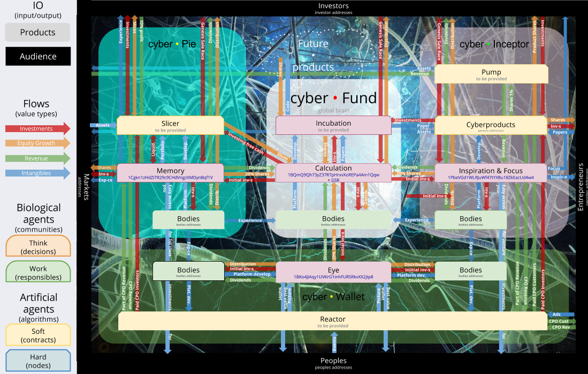

# Programming cyber • Fund

## Inception

### Meaning

Cyber•Fund is the first global brain invented with mission to make cybernetic economy come truth.

### Purpose
Cyber•Fund is product oriented artificial intelligent network that empower the most intelligent networks with the most ingenious products evolving cybernetic economy to the space exploration.

### Uniqueness
Cyber•Fund architected:
* with deep understanding of cybernetic economy. Global brain concept in mind of cyber•Fund adopts theory and power of cybernetics to more applicable space of cryptocurrency networks transforming any of them to perceived global brain.
* with both innovative and disruptive business model. Cybernetics business framework makes possible heart of cyber•Fund beats faster then any existing entity.
* to exist Independently on any artificial intelligent network. Proof-of-origin paradigm as frame makes cyber•Fund almost immortal.

### Philosophy
Liberty, Truth, Equality.

### Principles
We follow basic principles of [decentralised autonomous organisations](https://en.wikipedia.org/wiki/Decentralized_Autonomous_Organization#Decentralized_Autonomous_Corporations.2FCompanies_.28DACs.29) adding more structure.

### Goals
* To bigbang cybernetic economy.
* Reinvent a lot of things keeping planet in harmony.
* Evolve human motivation paradigm to more balanced perception of anything.
* Space discovery.

### Technology concept

* [Bitcoin protocol](https://en.bitcoin.it/wiki/Protocol_specification) form the mind.
* For solve problems chosen [Ethereum](https://github.com/ethereum/wiki/wiki), [Next](http://wiki.nxtcrypto.org/wiki/Whitepaper:Nxt), [BitsharesX](https://docs.google.com/a/cyberfund.io/document/d/1RLcjSXWuU9vBJzzqLEXVACSCdn8zXKTTJRN_LfoCjNY/edit), [Ripple](https://ripple.com/ripple_primer.pdf), [Counterparty](https://github.com/CounterpartyXCP/Counterparty), [Colored coins](https://github.com/OpenAssets/open-assets-protocol/blob/master/specification.mediawiki) and [MaidSafe](https://github.com/maidsafe/Whitepapers/blob/master/Project-Safe.md). That is heart.
* Body on top of [Web Components](http://webcomponents.org/) using [Polymer](http://www.polymer-project.org/) will provide awesome compatibility with future web, awesome cross device interfaces and groundbreaking speed of front-side development.
* [Digital Data Layer](http://www.w3.org/2013/12/ceddl-201312.pdf) as lungs will supply mind and heart with vital marketing elements.
* [Material design](http://www.google.com/design/spec/material-design/introduction.html) could make cyber•Fund more material.

### Incepting

1. Genesis Address has invented [1BQmQ9Qh73yZ37R7pHrxvXoREPa4Am1Qqw](https://www.coinprism.info/address/1BQmQ9Qh73yZ37R7pHrxvXoREPa4Am1Qqw).
2. \#cyberfund channel published.
3. 1 000 000 of [true cyber•Shares](https://www.coinprism.info/asset/3BUQAssohZgE13keAeRTgy5jnGSHR1v119) ever existed. Cyber•Share could be divisible into 1 000 000 neurons.
4. Cyber•Fund proves its existence with proof-of-origin of cyber•Shares.
5. Cyber•Fund have programed itself with this paper following cybernetic business framework guidelines.
6. Cyber•Fund makes consensus based decision.
7. Cyber•Fund have visited [notary](http://www.proofofexistence.com/), received [proof of existence](https://blockchain.info/tx/cf6bc6827091a10a6759d500db9b00dd8ea689444eca1f009cfd39c4cd060efc) and [published paper](https://bitcointalk.org/index.php?topic=789798.0) September 20, 2014.
8. This paper is subjective perception of creator and it want to be improved by community. After publishing the paper will be restructured to wiki format and moved to [cyber•Wiki](http://wiki.cyber.fund/Main_Page). So after gathering feedback new version will be born as community release.

## Seed

Main goal of seed stage is to build great community who will deliver 3 core products: Wallet, Pie & Inceptor. That products is the core of cyber•Fund and will boost ecosystem of cybereconomy.
Genesis team

* [Dima Starodubcev](https://onename.io/21xhipster)
* Vitaly Lvov
* Marina Guryeva
* [Konstantin Lomashuk](https://onename.io/creat0r)
* Max Uvarov
* Dmitry Sadovnychyi
* Vladimir Savin
Genesis neurons serves as starting trust network through cyber•Fund global brain creation. The need for Genesis team caused by necessity of the body who responsible for initial investments and leading cyber•Fund to birth. Cyber•Fund designed to be implemented fully independent from Genesis team eventually.

### Communications

* cyber•Fund fall in love to [Trello](https://trello.com/cyberfund). He feels that this is awesome way to build product oriented communities.
* At that moment he realized that source code will live inside [Github](https://github.com/cyberFund).
* Reddit is convenient place with awesome community to disсuss almost anything. But cyber•Fund asks help of community to allow subreddit [r/cyberFund](http://www.reddit.com/r/cyberFund).
* [cyber•Wiki](http://wiki.cyber.fund) is great place to accumulate structured knowledges.
* [cyber•Forum](http://forum.cyber.fund) is our community.
* All important updates happens in [cyber•Blog](http://blog.cyber.fund).
* Of course cyber•Fund like to [tweet](https://twitter.com/cyberfundio).
* There is two more official channels: [Google+](https://plus.google.com/+CyberfundIo/posts) and [Facebook](https://www.facebook.com/cyberfund) that replicates some important information.
* Managing values

Through multisig wallet 3 of 5 somebody from genesis team (entropy is provided for our safety) responsible for controlling withdrawals of funds and revenue flows from core addresses (GSR and Genesis) in accordance with this paper. Though there is no multisig solution for controlling shares the same way it should be implemented as soon as possible.

### What is cyber•Shares?
Cyber•Shares is metaproduct that represents cyber•Fund for doers who believe that cyber•Fund adds significant value to artificial intelligence industry.
Shares give for shareholders:
* Possibility to earn through growth of capitalization.
* Ability to use special features in cyber•Fund products.
* Right to make cybernetic decisions.
Motivation to involve into great community to explore and improve groundbreaking technology.

### Distribution
Initial distribution of cyber•Shares happens through Genesis Sale Race. Genesis Sale Race has been developed with all best practices of venture industry. Though the purpose of Genesis Sale Race is not only funding. With funding or not cyber•Fund team will do their best in the pursuit of dreams. Main goal of Genesis Sale Race is to form the community of minded peoples who motivated to growth their capital through cyber•Fund meaning. Details of Genesis Sale Race is provided in Appendix A.

### Voting
* Voting could be initiated by any shareholder.
* For voting process there is simple [Trello board](https://trello.com/b/maY9Nlp8/cyber-shares). Everybody welcomes to join.
* Voting announcements should be published to [official twitter](https://twitter.com/cyberfundio).
* Vote accepted if within 24 hours after publishing to twitter from ownership address sent at least 1 satoshi with 1 conformation to voting address.
* For shares issued under Next and BitsharesX protocols further instructions will be provided.
* Periodically will be published plans for voting and results of voting to [cyber•Blog](http://blog.cyber.fund/).
* Voting as process will evolve after arriving or developing better tools.

### Value model
Cybernetic business model that form value for every participant of the system living in the core of cyber • Fund represented in one picture. For make it understandable it follows decomposition principle. For every product should be described low level value model.

Full size picture published in [png](https://drive.google.com/file/d/0B9S_086dsM0HNmxmWndHQlF0OEE/edit?usp=sharing) and [svg](https://drive.google.com/file/d/0B9S_086dsM0HbGR3d1FQRENpN2s/edit?usp=sharing) or could be commented in Google Docs.
Cyber • Fund is mixed type of commercial and non-commercial organisation and will tend to keep this balance. But we starting from commercial functions to build in strong survival mechanism inside our structures.
Model shows that though there is a lot of science problems within industry that is [described by Vitalik](https://github.com/ethereum/wiki/wiki/Problems) cyber•Fund will concentrate on solving product level or consumer problems.

### Why there is no dividends?
Cyber•Fund designed for continuous development. All the profits from the cyber•Fund are to be reinvested in existing and new products (look the Road Map) or to be invested in cyber•Pie, in product the main purpose of which to maximize capitalization in Bitcoins. Therefore all profits will be reinvest in growth of cyber•Fund that will reflect on the growth of cyber•Fund capitalization namely increase in the value of shares. Google use the same strategy. They have never paid dividends, and all income earned reinvest in the companies growth. All dividends could be paid from product level shares.

### What is cyber?
There is a lot of terms that represents the same thing with tiny differences or no difference at all: cryptosecurity, cryptoshare, cryptotoken, cryptoasset, cryptoequity etc. We propose to use more simple and understandable term cyber for anything that represent not only crypto, but something more intelligent.
* Cyber as noun - any share in artificial intelligent network. Example: Founders will have 5% of cybers after Genesis Sale Race.
* Cyber as verb - To connect something with cyberspace. Example: There is reason to cyber this ingenious proposal.
* Cyber as adjective - To describe something as very intelligent, the most intelligent. In two years cyber girls begin to believe in automagic future proposed by cyberFund.
* Cyber as prefix - Use it to expand or empower some usual meaning of noun, verb or adjective with powerful cyber concept. For instance: cybereconomy, cybersend, cyberfast, cyberanything.

### Social consensus
According to [10 natural laws](http://wiki.bitshares.org/index.php/Ten_Natural_Laws_of_the_Crypto-Asset_Universe) of crypto asset universe there is the consensus that exists between the cyber•Fund team, cyber•Fund shareholders, and third-parties who would like to use the cyber•Fund branding, technologies and codebase. While anyone is free to use the cyber•Fund developments, one gets fully endorsed and promoted by the cyber•Fund team and the cyber•Fund community only if that developer allocates 10% to cyber•Fund as a way to honor cyber•Share holders their contributions that made the cyber•Fund developments possible.

## Core products
Without core products cyber•Fund has low chances for automagic and rapid evolving because core product are inherent components of architected cyber•Fund global brain.

### cyber•Wallet
Problem: There is no embeddable wallet for issuing and managing digital assets within core protocols: Colored coins, Counterparty, Next, Ripple, BitsharesX and Ethereum. Using this zoo is too complicated for your grandpa.
Solution: cyber•Wallet - easy to use trustless embeddable multisig wallet for any digital property with intelligent adaptive learning engine.
cyber•Wallet is core cyber•Fund product for everybody, for developers, for entrepreneurs, for marketers and any future cyber products. cyber•Wallet acts as perception mechanism or eye and make possible for global brain to see what happens. Follow product status on [Trello Board](https://trello.com/b/wfkbZ8m6/cyber-wallet).

### cyber•Pie
Problem: Too complicated to invest in crypto assets for everybody. Need expertise to make decisions, need knowledges to execute.
Solution: cyber•Pie - the most intelligent investment portfolio ever existed in one click.
Awesome investment tool for those who believe in global brains opportunities. Cyber•Pie investors certain about their future. Portfolio is designed to growth faster than Bitcoin! Cyber•Pie is core cyber•Fund product for generating revenues and growthing authority. Cyber•Pie acts as memory of global brain. Memory want to remember more and only the best values. Follow product status on [Trello Board](https://trello.com/b/WKOtb0lN/cyber-pie).

### cyber•Inceptor
Problem: Local attention mechanisms of global brain into a collective attention of the group. The two problems involving the attention mechanism are of course strongly coupled. In fact they can be considered as two aspects of the same problem. The first aspect focuses on modeling the cognitive agents in functional terms without highlighting how the functional components are implemented. The second aspect is inspired by a connectionist approach that highlights the emergence of functionality, at any level, from the interactions of elements one level lower.
Solution: cyber•Inceptor - Focus and Inspiration of cyber•Fund global brain.
cyber•Inceptor is crowdfunding platform which help cybernetic companies to receive investments in exchange for shares. cyber•Inceptor is input of cybernetic economy, entrepreneurs just need to download the paper to the platform and all the community (global brain) will be Focused and Inspired. Cyber•Inceptor - Automagic evolving of any idea for inventors of 3 millenium. Follow product status on [Trello Board](https://trello.com/b/3RBp9SsZ/cyber-inceptor).

## Birth, Infancy and so on.
Though we have huge [pack of ideas](https://docs.google.com/a/cyberfund.io/spreadsheets/d/1rks92sn8Ft_GU41q7P6VSrUHUJ5NKllYnCn4jsAuYL8/edit#gid=198127602) for future products there is no meaning to discuss it before at least successful funding and great interest from community. That is community right and responsibility to shape future of cyber•Fund developments.